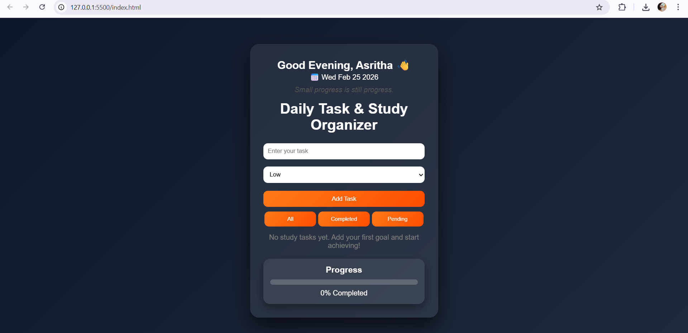
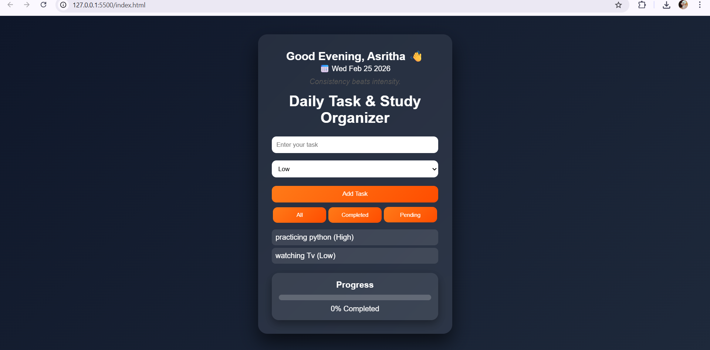
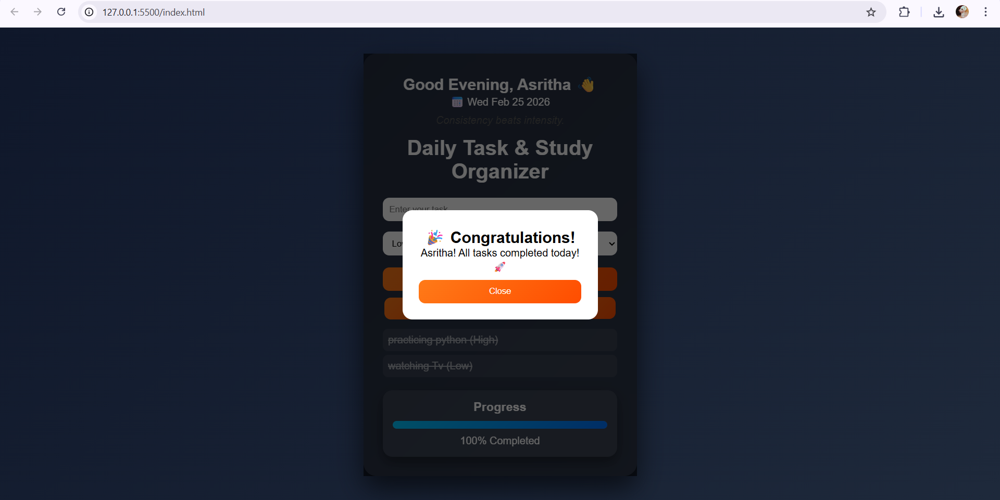

# StudySync – Plan. Track. Achieve.

A simple and clean web-based study planner that helps students organize daily tasks, assign priorities, and track progress visually.

---

## 🔗 Live Demo
👉 Try it here: https://your-netlify-link.netlify.app  

## 🎥 Video Demo
👉 Watch on YouTube: https://youtube-link-here

---

## 📌 About the Project

StudySync is designed to help students stay consistent with their daily study goals.  
It provides a minimal and beginner-friendly interface to add tasks, set priorities, and monitor completion progress.

The focus of this project is simplicity, clarity, and motivation through visible progress tracking.

---

## ✨ Features

- Add and delete tasks  
- Assign priority levels (Low / Medium / High)  
- Filter tasks (All / Completed / Pending)  
- Dynamic progress bar updates  
- Personalized greeting on first visit  
- Data persistence using Browser LocalStorage  

---

## 🛠️ Built With

- HTML5  
- CSS3  
- JavaScript (ES6)  
- Browser LocalStorage API  

---

## ⚙️ How It Works

1. On first visit, the app asks for the user’s name.
2. The dashboard greets the user.
3. Tasks can be added with priority levels.
4. Tasks can be marked as completed.
5. Progress is calculated dynamically:

\[
Progress = \frac{\text{Completed Tasks}}{\text{Total Tasks}} \times 100
\]

6. All data is saved in the browser using LocalStorage.

---

## 📷 Screenshots

### 🔹 Dashboard View

### 🔹 Tasks Added

### 🔹 Completion State

---

## 🚀 Future Improvements

- Cloud-based storage
- User authentication
- Study streak tracking
- Deadline reminders
- Analytics dashboard
- Dark mode support

---

If you found this project useful, feel free to star ⭐ the repository.